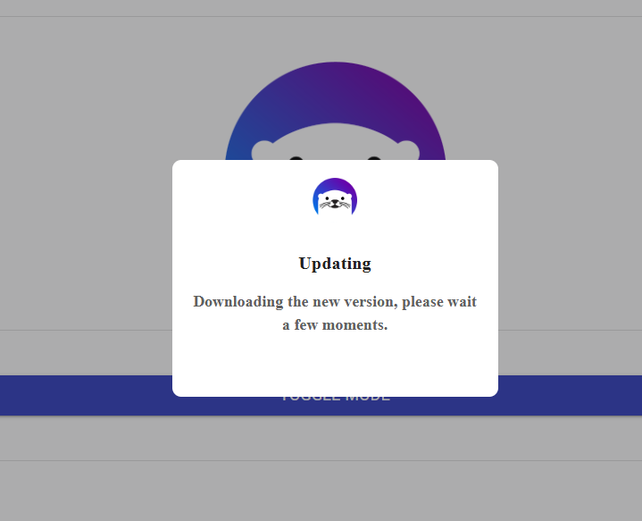
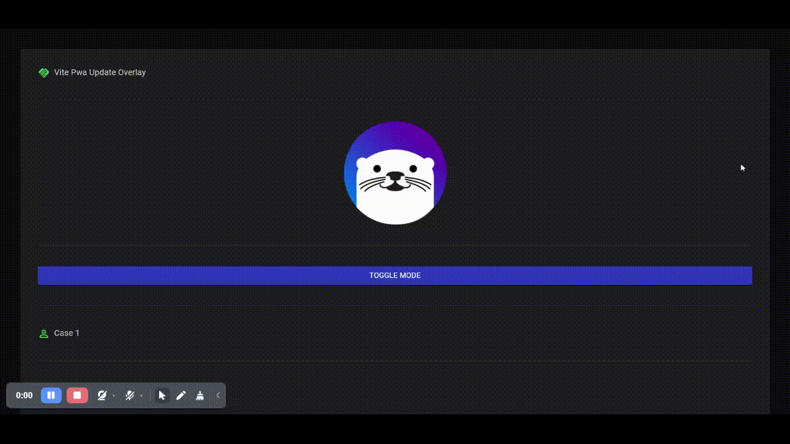

# Vite PWA Update Overlay

React + TypeScript + Vite app for testing PWA service worker updates with a visible update overlay.

The project intentionally renders a large MUI icon workload so production builds have a heavier JavaScript payload. That makes it easier to see what users experience while an older cached version is still visible and a newer service worker version is being installed.

## Preview





## Features

- Vite + React + TypeScript
- MUI UI and icon rendering
- Persisted light/dark mode toggle
- `vite-plugin-pwa` with generated service worker
- Auto-update flow with `skipWaiting` and `clientsClaim`
- Full-screen update overlay while a new version installs
- Shared `heavyIconNames` list used to render many icon cases
- Extra heavy stress grid for testing large update payloads

## Scripts

```bash
npm run dev
npm run build
npm run preview
npm run lint
npm run build:check
```

Development server:

```text
http://localhost:3037
```

Production preview:

```text
http://localhost:3000
```

## How The Demo Works

`src/App.tsx` renders the app shell, logo, mode toggle, and a list of icon cases from `src/constants/heavyIconNames.ts`.

`src/components/Case.tsx` receives an icon name and index, looks up the matching MUI icon, and renders a simple case row.

`src/components/HeavyUpdateCases.tsx` uses the same icon-name list to generate a grid of stress cases. This keeps the source code easier to change while still forcing Vite to include a large icon workload in the built app.

`src/main.tsx` registers the service worker and manages the update overlay. When a new service worker starts installing, the overlay appears. After activation, the page reload flow is guarded with session storage so the update state can survive reloads without looping forever.

## Testing PWA Updates

1. Build the app:

```bash
npm run build
```

2. Serve the production build:

```bash
npm run preview
```

3. Open `http://localhost:3000` and let the service worker register.

4. Change something visible, for example text in `src/App.tsx`, `src/components/Case.tsx`, or `src/constants/heavyIconNames.ts`.

5. Build again:

```bash
npm run build
```

6. Refresh or revisit the preview page. The current cached app can remain visible while the new service worker downloads and installs. The overlay appears during that update flow.

## PWA Configuration

The PWA setup lives in `vite.config.ts`.

Important options:

- `registerType: "autoUpdate"`
- `devOptions.enabled: true`
- `workbox.navigateFallback: "index.html"`
- `workbox.skipWaiting: true`
- `workbox.clientsClaim: true`
- `workbox.cleanupOutdatedCaches: true`
- `workbox.maximumFileSizeToCacheInBytes: 8 * 1024 * 1024`

The larger precache limit is intentional. The app bundle is large because the demo imports and renders many MUI icons to make update downloads easier to observe.

## Source Map

- `src/main.tsx`: service worker registration and update overlay logic
- `src/App.tsx`: app layout and rendered case list
- `src/components/Case.tsx`: reusable single icon case
- `src/components/HeavyUpdateCases.tsx`: heavy stress grid
- `src/constants/heavyIconNames.ts`: icon names used by the demo
- `src/theme/index.tsx`: MUI theme provider and mode setup
- `vite.config.ts`: Vite, React compiler, and PWA configuration
